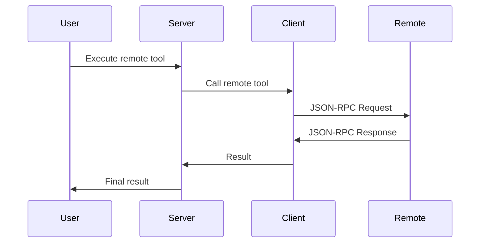

# MCP Integration

How Agents MCP Server integrates with the Model Context Protocol.

## What is MCP?

The Model Context Protocol (MCP) is a standardized protocol for AI assistants to interact with external tools and data sources. It enables:

- **Tool Discovery**: Find available tools
- **Tool Execution**: Execute tools with parameters
- **Resource Access**: Access external resources
- **Prompt Templates**: Use pre-defined prompts

## Server vs Client

Agents MCP Server operates as both:

### As an MCP Server
- Exposes tools via JSON-RPC 2.0
- Handles tool discovery and execution
- Provides health checks and status

### As an MCP Client
- Connects to remote MCP servers
- Fetches tools and prompts
- Executes remote tools

## MCP Protocol Methods

### Server-Side Methods

#### `initialize`
Protocol handshake and capability negotiation.

```json
{
  "jsonrpc": "2.0",
  "method": "initialize",
  "params": {}
}
```

**Response**:
```json
{
  "jsonrpc": "2.0",
  "result": {
    "protocolVersion": "2024-11-05",
    "serverInfo": {
      "name": "agents-mcp-server",
      "version": "1.0.0"
    },
    "capabilities": {
      "tools": {},
      "prompts": {},
      "resources": {},
      "sampling": {}
    }
  }
}
```

#### `tools/list`
List all available tools.

```json
{
  "jsonrpc": "2.0",
  "method": "tools/list",
  "params": {}
}
```

**Response**: Array of tools with schemas

#### `tools/call`
Execute a tool.

```json
{
  "jsonrpc": "2.0",
  "method": "tools/call",
  "params": {
    "name": "tool_name",
    "arguments": {}
  }
}
```

### Client-Side Methods

The server can call these on remote MCP servers:

- `initialize` - Initialize connection
- `tools/list` - Fetch remote tools
- `tools/call` - Execute remote tool
- `prompts/list` - Fetch remote prompts
- `resources/list` - Fetch remote resources

## Remote Tool Execution

### Flow



### Implementation

**Location**: `src/utils/mcpClient.ts`

```typescript
// Pseudo-code
async function executeRemoteTool(toolName: string, args: any) {
  const response = await fetch(remoteServerUrl, {
    method: 'POST',
    body: JSON.stringify({
      jsonrpc: '2.0',
      method: 'tools/call',
      params: {
        name: toolName,
        arguments: args
      }
    })
  });
  return response.json();
}
```

## Tool Synchronization

### Initialization

Tools can be initialized from remote servers:

```json
{
  "method": "tools/call",
  "params": {
    "name": "init_tools",
    "arguments": {
      "source": "remote",
      "force": false
    }
  }
}
```

### Process

1. Connect to remote MCP server
2. Fetch tools via `tools/list`
3. Store in local database
4. Create Pinecone embeddings for search
5. Index for fast retrieval

## Sampling Support

MCP Sampling allows tools to request AI assistance during execution.

### Capabilities

The server supports sampling in its capabilities:

```json
{
  "capabilities": {
    "sampling": {}
  }
}
```

### Usage

Tools can use sampling to:
- Request AI analysis
- Generate recommendations
- Make intelligent decisions

## Resource Management

### Local Resources

Resources stored in the database can be:
- Listed via `resources/list`
- Read via `resources/read`

### Remote Resources

Remote resources are fetched from connected MCP servers.

## Integration Points

### With Other MCP Servers

1. **Connection**: Configure remote server URL
2. **Initialization**: Fetch tools and prompts
3. **Execution**: Execute remote tools via client
4. **Synchronization**: Keep tools up-to-date

### With MCP Clients

1. **Expose Endpoint**: Server exposes `/sse` endpoint
2. **Handle Requests**: Process JSON-RPC requests
3. **Execute Tools**: Run local or remote tools
4. **Return Results**: Format JSON-RPC responses

## Best Practices

### Remote Server Configuration

- Use environment variables for URLs
- Implement retry logic for failures
- Cache tool schemas for performance
- Monitor connection health

### Tool Management

- Regular synchronization with remote servers
- Version tracking for tool changes
- Semantic search for tool discovery
- Category-based organization

## Next Steps

- Learn about [Core Components](./core-components.md)
- Explore [Data Models](./data-models.md)
- Check [API Reference](../api-reference/protocol.md)

