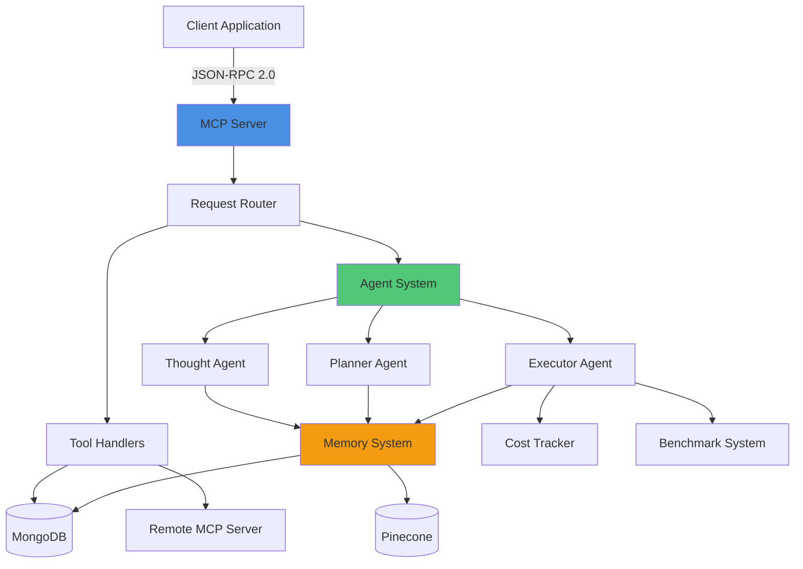
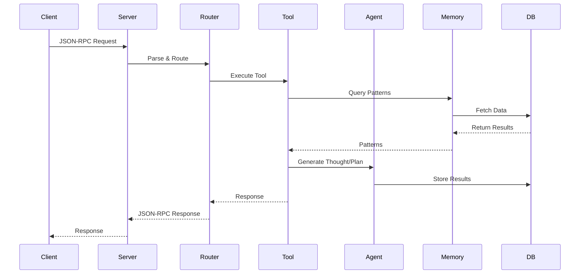
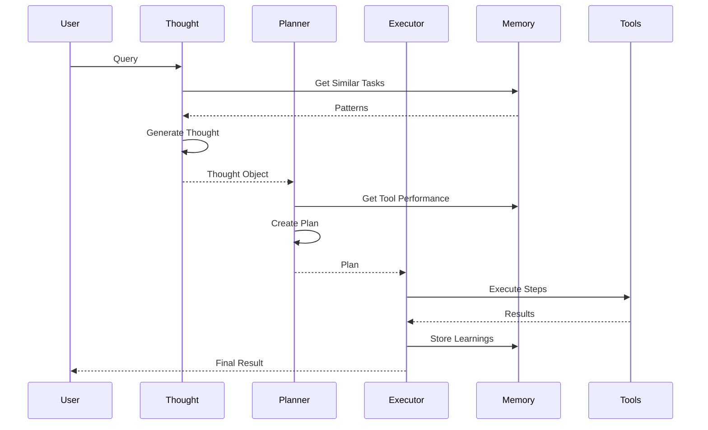

# Architecture Overview

This document provides a high-level overview of the Agents MCP Server architecture.

## System Overview

Agents MCP Server is a hybrid MCP (Model Context Protocol) server and client that provides:

- **Tool Management**: Store, search, and execute MCP tools
- **AI Agent System**: Thought, Planner, and Executor agents for complex task handling
- **Memory & Learning**: Persistent memory system that learns from executions
- **Intelligence Features**: Quality prediction, recommendations, and optimization
- **Benchmarking**: Performance tracking and regression detection

## High-Level Architecture

## Core Components

### 1. MCP Server Layer

The server exposes a JSON-RPC 2.0 API endpoint that handles:

- **Initialization**: Protocol handshake
- **Tool Discovery**: List available tools
- **Tool Execution**: Execute tools with validation
- **Resource Access**: Read resources (future)
- **Prompt Access**: Get prompts (future)

**Location**: `src/index.ts`

### 2. Tool Management System

Manages tools stored in the database and provides:

- CRUD operations for tools
- Semantic search via Pinecone
- Remote tool execution
- Tool validation

**Location**: `src/tools/management/toolTools.ts`

### 3. Agent System

Three-layer agent architecture:

#### Thought Agent
- Analyzes user queries
- Generates structured thoughts
- Explores solution approaches
- **Location**: `src/utils/thoughtGenerator.ts`

#### Planner Agent
- Converts thoughts to executable plans
- Handles dependencies
- Extracts parameters
- **Location**: `src/utils/planGenerator.ts`

#### Executor Agent
- Executes plans step-by-step
- Handles errors and retries
- Manages user prompts
- **Location**: `src/utils/taskExecutor.ts`

### 4. Memory System

Persistent learning system that:

- Stores successful patterns
- Tracks tool performance
- Learns user preferences
- Generates insights

**Components**:
- Pattern Memory
- Tool Memory
- User Preference Memory
- Insight Storage

**Location**: `src/utils/memorySystem.ts`

### 5. Intelligence Features

Smart features that enhance decision-making:

- **Plan Quality Prediction**: Predict success before execution
- **Tool Recommendations**: Optimize tool selection
- **Plan Refinement**: Auto-improve failed plans
- **Cost Tracking**: Monitor and optimize costs

**Location**: `src/utils/planQualityPredictor.ts`, `src/utils/toolRecommendationEngine.ts`

### 6. Benchmark Suite

Performance tracking and quality assurance:

- Test definitions
- Execution tracking
- Regression detection
- Metrics collection

**Location**: `src/utils/benchmarkRunner.ts`

## Data Flow

### Request Flow

### Task Execution Flow

## Technology Stack

### Backend
- **Runtime**: Node.js 18+
- **Language**: TypeScript
- **Framework**: Express.js
- **Database**: MongoDB (Mongoose ODM)
- **Vector DB**: Pinecone (for similarity search)

### Protocols
- **MCP**: Model Context Protocol
- **JSON-RPC 2.0**: Request/response protocol
- **HTTP**: Transport layer

### AI Integration
- **OpenAI**: GPT models
- **Anthropic**: Claude models
- **Ollama**: Local models (optional)

## Data Models

### Core Models

- **Tool**: Tool definitions and metadata
- **AgentConfig**: AI model configurations
- **Thought**: Structured reasoning objects
- **Plan**: Executable action plans
- **Task**: Execution tracking
- **Request**: User query tracking

### Intelligence Models

- **MemoryPattern**: Learned patterns
- **ToolPerformance**: Tool metrics
- **UserPreference**: User-specific learnings
- **AgentInsight**: Learned insights
- **BenchmarkTest**: Test definitions
- **CostTracking**: Cost metrics

See [Data Models](./data-models.md) for detailed schemas.

## Security Considerations

### Authentication
- API keys for AI models stored securely
- Environment variable management
- No authentication on server (can be added)

### Data Protection
- MongoDB connection security
- Environment variable encryption (recommended)
- Secure API key storage

### Best Practices
- Never commit `.env` files
- Use strong passwords
- Enable MongoDB authentication
- Regular security updates

## Scalability

### Horizontal Scaling
- Stateless server design
- MongoDB connection pooling
- Pinecone scalable indexes

### Performance Optimization
- Connection pooling
- Caching strategies
- Background job processing
- Efficient vector searches

## Monitoring

### Health Checks
- `/health` endpoint
- MongoDB connection status
- Server uptime

### Metrics
- Tool execution times
- Success rates
- Cost tracking
- Performance benchmarks

## Next Steps

- Learn about [Core Components](./core-components.md)
- Explore [Data Models](./data-models.md)
- Understand [Request Flow](./request-flow.md)
- Check [MCP Integration](./mcp-integration.md)

