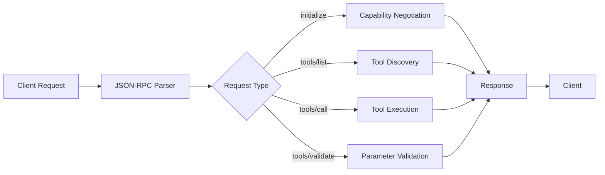
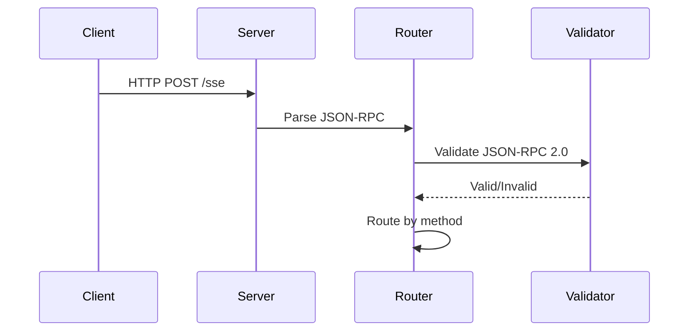
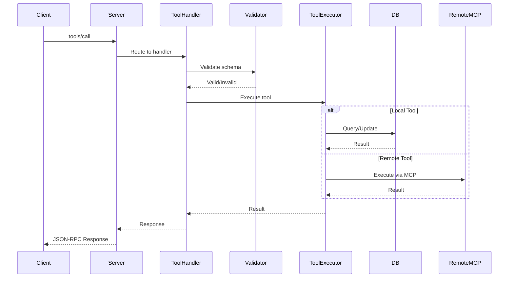
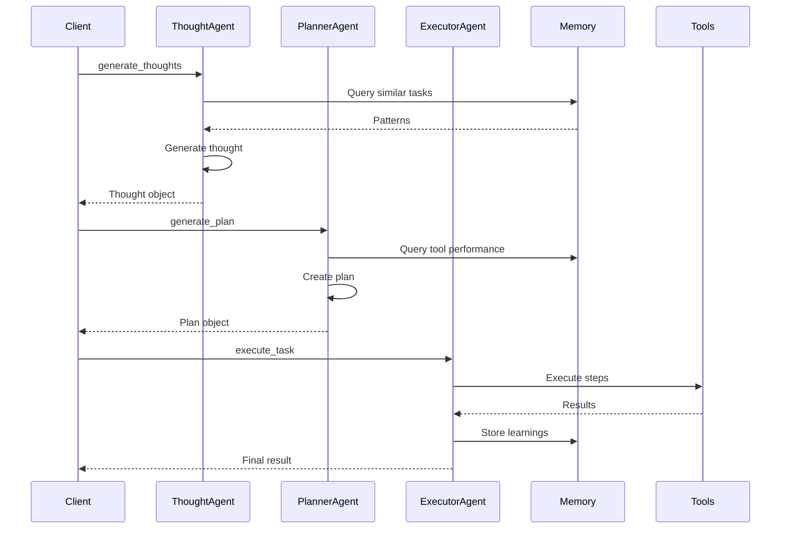
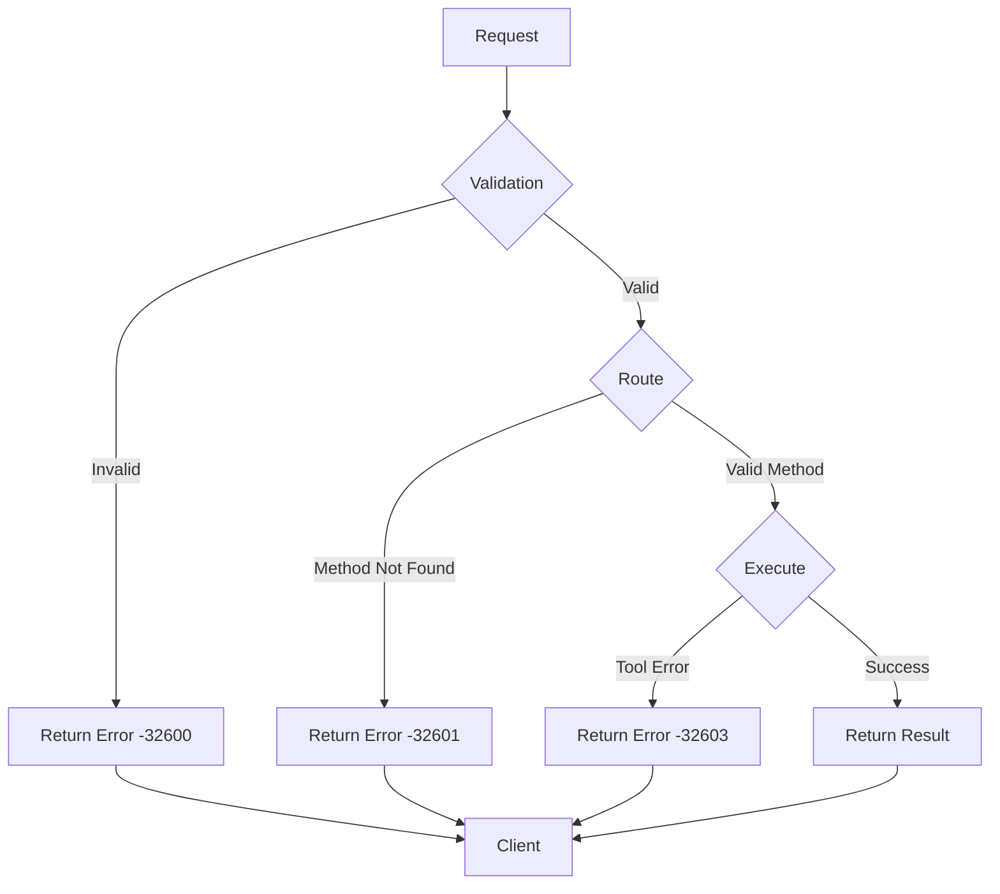

# Request Flow

Understanding how requests flow through the Agents MCP Server.

## High-Level Flow



## Detailed Request Flow

### 1. Request Reception



**Location**: `src/index.ts` - Express route handler

### 2. Method Routing

The server routes requests based on the `method` field:

```typescript
// Pseudo-code
switch (method) {
  case 'initialize':
    return handleInitialize();
  case 'tools/list':
    return handleToolsList();
  case 'tools/call':
    return handleToolsCall();
  case 'tools/validate':
    return handleToolsValidate();
  default:
    return error('Method not found');
}
```

### 3. Tool Execution Flow



### 4. Agent Execution Flow

When executing agent tools (Thought, Planner, Executor):



## Error Handling

### Error Flow



### Error Codes

- **-32600**: Invalid Request (invalid JSON-RPC format)
- **-32601**: Method Not Found
- **-32602**: Invalid Params (validation failed)
- **-32603**: Internal Error (execution error)

## Response Format

### Success Response

```json
{
  "jsonrpc": "2.0",
  "id": "request-id",
  "result": {
    "content": [
      {
        "type": "text",
        "text": "{\"result\": \"data\"}"
      }
    ],
    "isError": false
  }
}
```

### Error Response

```json
{
  "jsonrpc": "2.0",
  "id": "request-id",
  "result": {
    "content": [
      {
        "type": "text",
        "text": "Error message"
      }
    ],
    "isError": true
  }
}
```

## Performance Considerations

### Caching

- Tool schemas cached in memory
- Pinecone indexes for fast similarity search
- MongoDB connection pooling

### Optimization

- Parallel execution where possible
- Background job processing
- Efficient database queries with indexes

## Next Steps

- Learn about [MCP Integration](./mcp-integration.md)
- Explore [Core Components](./core-components.md)
- Check [API Reference](../api-reference/protocol.md)

