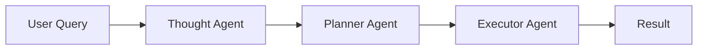

# Agent System

AI-powered agents for intelligent task execution.

## Architecture

The system uses three agents:

1. **Thought Agent**: Analyzes user queries and generates structured reasoning
2. **Planner Agent**: Converts thoughts into executable plans
3. **Executor Agent**: Executes plans step-by-step

## Workflow



## Tools

### Thought Generation

```javascript
const thought = await callTool('generate_thoughts', {
  userQuery: 'Manage facility inspections',
  agentConfigId: 'config-id'
});
```

### Plan Generation

```javascript
const plan = await callTool('generate_plan', {
  thoughtId: 'thought-id',
  agentConfigId: 'config-id'
});
```

### Task Execution

```javascript
const task = await callTool('execute_task', {
  planId: 'plan-id',
  agentConfigId: 'config-id'
});
```

## Configuration

See [Agent Configurations](../guides/agent-configurations.md) for setup details.

