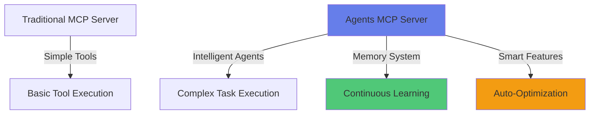
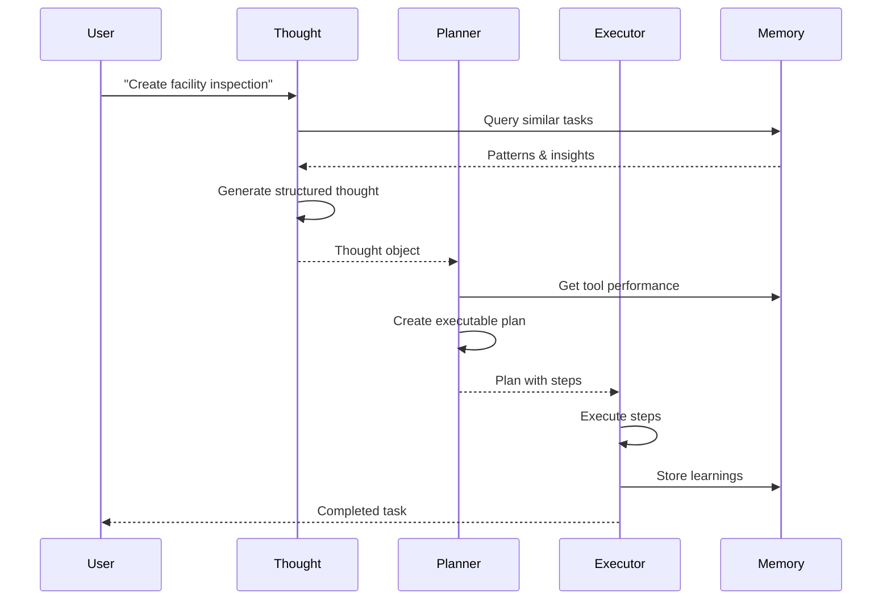
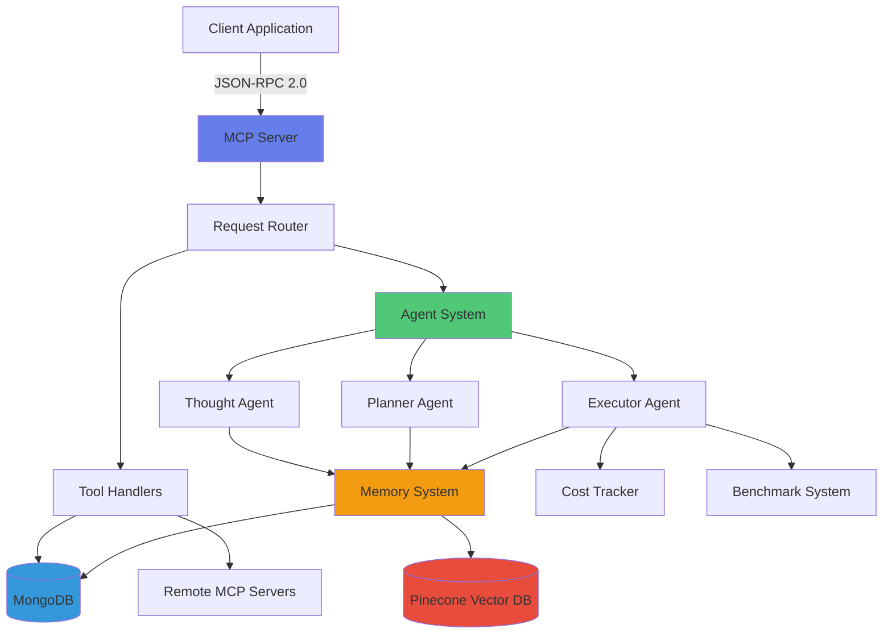

# Agents MCP Server

<div style={{
  padding: '2rem',
  background: 'linear-gradient(135deg, #667eea 0%, #764ba2 100%)',
  borderRadius: '8px',
  color: 'white',
  marginBottom: '2rem',
  textAlign: 'center'
}}>

## 🚀 Intelligent AI Agent Platform

**Agents MCP Server** is a production-ready, enterprise-grade Model Context Protocol (MCP) server that combines AI-powered autonomous agents with persistent memory, continuous learning, and intelligent decision-making capabilities.

**Transform complex tasks into automated workflows with AI agents that learn and improve over time.**

</div>

## What is Agents MCP Server?

Agents MCP Server is a **hybrid MCP server and client** that enables AI assistants to execute complex, multi-step tasks autonomously. Unlike traditional MCP servers that simply expose tools, Agents MCP Server provides:

- **🧠 Intelligent Agent System**: Three-layer AI architecture (Thought → Plan → Execution) that breaks down complex queries into actionable steps
- **💾 Persistent Memory**: Learns from every execution, building patterns and insights that improve future performance
- **🎯 Smart Decision Making**: Quality prediction, tool recommendations, and automatic plan refinement
- **📊 Performance Intelligence**: Comprehensive benchmarking, regression detection, and cost optimization
- **🔌 Universal Tool Hub**: Manage, search, and execute tools from any MCP server, local or remote

### Key Differentiators



**Traditional MCP Servers**: Execute individual tools on request  
**Agents MCP Server**: Understands intent, creates plans, executes workflows, learns from results, and optimizes for future tasks

## Core Capabilities

### 🧠 Intelligent Agent System

A three-layer architecture that transforms natural language queries into successful task executions:

**Thought Agent** → Analyzes queries, explores solutions, considers constraints  
**Planner Agent** → Creates executable plans with dependencies and parameters  
**Executor Agent** → Executes plans step-by-step with error handling and retries



**Learn more**: [Agent System →](./features/agent-system.md)

### 💾 Memory & Learning System

The system learns from every execution, building a persistent knowledge base:

- **Pattern Memory**: Recognizes successful patterns and reuses them
- **Tool Performance**: Tracks which tools work best for which scenarios
- **User Preferences**: Learns your workflow patterns and preferences
- **Insight Generation**: Automatically generates insights from execution history

**Example**: After executing "create inspection" multiple times, the system learns your preferred inspection structure and automatically suggests it for future tasks.

**Learn more**: [Memory System →](./intelligence/memory-system.md)

### 🎯 Smart Features

Intelligent capabilities that enhance decision-making:

- **Quality Prediction**: Predict plan success probability before execution
- **Tool Recommendations**: AI-powered suggestions for optimal tool selection
- **Plan Refinement**: Automatically improve failed plans based on past learnings
- **Cost Optimization**: Track and optimize token usage and API costs

**Learn more**: [Smart Features →](./intelligence/smart-features.md)

### 📊 Benchmarking & Quality Assurance

Production-grade testing and monitoring:

- **Automated Test Suites**: Pre-built test suites for common scenarios
- **Performance Metrics**: Track success rates, execution times, and costs over time
- **Regression Detection**: Automatically detect performance degradations
- **A/B Testing**: Compare different approaches and configurations

**Learn more**: [Benchmark Suite →](./intelligence/benchmark-suite.md)

### 🔌 Universal Tool Management

Manage tools from any source:

- **Local Tools**: Store and manage your own tools
- **Remote Tools**: Execute tools from remote MCP servers
- **Semantic Search**: Find tools using natural language queries
- **Tool Discovery**: Automatically discover relevant tools for tasks

**Learn more**: [Tool Management →](./features/tool-management.md)

## Architecture Overview



**Components**:
- **MCP Server Layer**: JSON-RPC 2.0 API endpoint
- **Tool Management**: CRUD operations, semantic search, remote execution
- **Agent System**: Three-layer intelligent execution
- **Memory System**: Persistent learning with vector search
- **Intelligence Layer**: Quality prediction, recommendations, optimization

**Learn more**: [Architecture Overview →](./architecture/overview.md)

## Who is this for?

### 👨‍💻 Engineers & Developers

**Backend Developers**
- Understand the architecture, API design, and integration points
- Learn how to extend the system with custom tools and agents
- Integrate Agents MCP Server into existing applications

**Frontend Developers**
- Build UIs that interact with the agent system
- Create dashboards for monitoring and management
- Implement real-time task execution interfaces

**DevOps Engineers**
- Deployment strategies and production setup
- Monitoring, logging, and performance optimization
- Scaling and high-availability configurations

### 📊 Non-Technical Stakeholders

**Product Managers**
- Understand capabilities and use cases
- Evaluate features and plan integrations
- Make informed decisions about adoption

**Business Analysts**
- Learn about automation opportunities
- Understand ROI and efficiency gains
- Identify use cases and workflows

**Decision Makers**
- High-level value proposition
- Competitive advantages
- Strategic positioning

## Quick Start Paths

Choose your path based on your goals:

### 🚀 I want to get started immediately

1. **[Install the Server](./getting-started/installation.md)** - 10 minutes
2. **[Run Your First Workflow](./guides/first-workflow.md)** - 15 minutes
3. **[Explore Examples](./examples/basic-workflow.md)** - 30 minutes

### 🎓 I want to understand the system first

1. **[Architecture Overview](./architecture/overview.md)** - System design and components
2. **[Core Concepts](./features/overview.md)** - Features and capabilities
3. **[API Reference](./api-reference/protocol.md)** - Complete API documentation

### 🔧 I want to integrate or extend

1. **[Development Guide](./development/project-structure.md)** - Codebase structure
2. **[Integration Examples](./development/integration.md)** - Connecting to other systems
3. **[Extending the System](./development/extending.md)** - Adding custom functionality

### 📚 I want comprehensive documentation

1. **[Complete Tool Reference](./api-reference/tools.md)** - All 100+ tools documented
2. **[Tutorial Guides](./guides/task-executor.md)** - Step-by-step tutorials
3. **[Best Practices](./development/best-practices.md)** - Production recommendations

## Common Use Cases

### Automated Workflow Execution

Transform complex, multi-step processes into automated workflows:

```javascript
// User query: "Create a facility inspection for facility ABC"
// System automatically:
// 1. Generates thought about inspection requirements
// 2. Creates plan with steps (get facility, check history, create inspection)
// 3. Executes plan with dependency management
// 4. Learns from execution for future improvements
```

**Example**: [Complex Workflow →](./examples/complex-workflow.md)

### Intelligent Tool Discovery

Automatically find and use the right tools for any task:

```javascript
// Query: "Create a new facility"
// System searches all tools, finds relevant ones, 
// recommends best tools based on past performance
```

**Example**: [Tool Discovery →](./guides/tool-management-complete.md)

### Cost Optimization

Track and optimize API costs across all operations:

```javascript
// System tracks token usage, suggests optimizations,
// predicts costs before execution
```

**Example**: [Cost Optimization →](./guides/cost-optimization.md)

### Performance Benchmarking

Ensure system quality and detect regressions:

```javascript
// Run automated test suites, track metrics,
// detect performance issues automatically
```

**Example**: [Benchmarking Guide →](./guides/benchmarks.md)

## Documentation Structure

This documentation is organized for easy navigation:

### 📖 Essential Reading

- **[Getting Started](./getting-started/installation.md)** - Installation, configuration, first steps
- **[Architecture](./architecture/overview.md)** - System design, components, data models
- **[API Reference](./api-reference/protocol.md)** - Complete API documentation with examples

### 🎯 Features & Capabilities

- **[Features Overview](./features/overview.md)** - All features explained in detail
- **[Intelligence Systems](./intelligence/overview.md)** - Memory, learning, and smart features
- **[Agent System](./features/agent-system.md)** - Thought, Planner, Executor architecture

### 📚 Guides & Tutorials

- **[Task Executor Guide](./guides/task-executor.md)** - Step-by-step task execution
- **[First Workflow](./guides/first-workflow.md)** - Complete first workflow tutorial
- **[Tool Management](./guides/tool-management-complete.md)** - Comprehensive tool guide

### 💻 Development

- **[Project Structure](./development/project-structure.md)** - Codebase organization
- **[Contributing](./development/contributing.md)** - How to contribute
- **[Best Practices](./development/best-practices.md)** - Production recommendations

### 📋 Examples

- **[Basic Workflow](./examples/basic-workflow.md)** - Simple end-to-end example
- **[Complex Workflow](./examples/complex-workflow.md)** - Multi-step with dependencies
- **[Memory Integration](./examples/memory-integration.md)** - Using memory in workflows

## What You'll Learn

By the end of this documentation, you'll be able to:

✅ **Set up and deploy** Agents MCP Server in production  
✅ **Execute complex workflows** using the agent system  
✅ **Manage tools** from local and remote sources  
✅ **Leverage memory** to improve task execution  
✅ **Optimize performance** using benchmarks and metrics  
✅ **Extend the system** with custom tools and capabilities  
✅ **Troubleshoot issues** and resolve common problems  

## Next Steps

Ready to get started? Here's what to do next:

1. **New to Agents MCP Server?**
   → Start with [Installation Guide](./getting-started/installation.md)

2. **Want to understand the architecture?**
   → Read [Architecture Overview](./architecture/overview.md)

3. **Ready to run your first workflow?**
   → Follow [First Workflow Tutorial](./guides/first-workflow.md)

4. **Need to find a specific tool?**
   → Browse [Complete Tool Reference](./api-reference/tools.md)

5. **Looking for examples?**
   → Explore [Examples Section](./examples/basic-workflow.md)

---

<div style={{
  padding: '1.5rem',
  background: '#f8f9fa',
  borderRadius: '8px',
  marginTop: '2rem',
  borderLeft: '4px solid #667eea'
}}>

### 💡 Pro Tip

**Start with the Quick Start** if you're new to the system. It will guide you through installation and your first successful workflow in under 30 minutes.

**Experienced developers** can jump straight to the [API Reference](./api-reference/tools.md) for complete tool documentation.

</div>

---

**Questions?** Check the [FAQ](./reference/faq.md) or [open an issue](https://github.com/wsyeabsera/v5-agent-mcp-server/issues) on GitHub.
