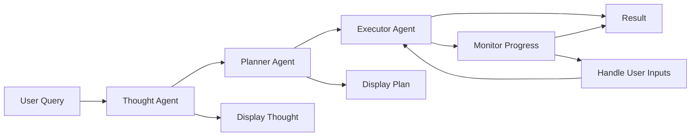

# Agent Workflows

Complete workflows for the agent system: Thought → Plan → Task Execution.

## Workflow Overview



## Step 1: Thought Generation

### Tool: `generate_thoughts`

Generate structured thoughts from a user query.

**Request:**
```json
{
  "jsonrpc": "2.0",
  "id": "1",
  "method": "tools/call",
  "params": {
    "name": "generate_thoughts",
    "arguments": {
      "userQuery": "Create a facility inspection for facility ABC",
      "agentConfigId": "config-id",
      "availableTools": [],
      "enableToolSearch": true
    }
  }
}
```

**Response:**
```json
{
  "jsonrpc": "2.0",
  "id": "1",
  "result": {
    "content": [
      {
        "type": "text",
        "text": "{\"_id\": \"thought-id\", \"userQuery\": \"...\", \"thoughts\": [{\"id\": \"...\", \"reasoning\": \"...\", \"approaches\": [...], \"confidence\": 0.9}], \"primaryApproach\": \"...\", \"recommendedTools\": [\"create_inspection\", \"get_facility\"]}"
      }
    ],
    "isError": false
  }
}
```

### React Component: Thought Generator

```jsx
import React, { useState } from 'react';

function ThoughtGenerator({ agentConfigId, onThoughtGenerated }) {
  const [query, setQuery] = useState('');
  const [loading, setLoading] = useState(false);
  const [thought, setThought] = useState(null);
  const [error, setError] = useState(null);

  const handleGenerate = async () => {
    if (!query.trim()) return;

    setLoading(true);
    setError(null);

    try {
      const result = await callTool('generate_thoughts', {
        userQuery: query,
        agentConfigId,
        enableToolSearch: true
      });

      setThought(result);
      onThoughtGenerated?.(result);
    } catch (err) {
      setError(err.message);
    } finally {
      setLoading(false);
    }
  };

  return (
    <div>
      <h2>Generate Thoughts</h2>
      
      <textarea
        value={query}
        onChange={(e) => setQuery(e.target.value)}
        placeholder="Enter your query..."
        rows={4}
      />
      
      <button onClick={handleGenerate} disabled={loading || !query.trim()}>
        {loading ? 'Generating...' : 'Generate Thoughts'}
      </button>

      {error && <div className="error">Error: {error}</div>}

      {thought && (
        <div className="thought-result">
          <h3>Generated Thought</h3>
          <div className="thought-id">ID: {thought._id}</div>
          <div className="primary-approach">
            <strong>Primary Approach:</strong> {thought.primaryApproach}
          </div>
          
          <div className="thoughts-list">
            <h4>Thoughts:</h4>
            {thought.thoughts.map((t, i) => (
              <div key={i} className="thought-item">
                <div className="confidence">
                  Confidence: {(t.confidence * 100).toFixed(0)}%
                </div>
                <div className="reasoning">{t.reasoning}</div>
                {t.approaches.length > 0 && (
                  <div className="approaches">
                    <strong>Approaches:</strong>
                    <ul>
                      {t.approaches.map((approach, j) => (
                        <li key={j}>{approach}</li>
                      ))}
                    </ul>
                  </div>
                )}
              </div>
            ))}
          </div>

          {thought.recommendedTools.length > 0 && (
            <div className="recommended-tools">
              <strong>Recommended Tools:</strong>
              <ul>
                {thought.recommendedTools.map((tool, i) => (
                  <li key={i}>{tool}</li>
                ))}
              </ul>
            </div>
          )}
        </div>
      )}
    </div>
  );
}
```

## Step 2: Plan Generation

### Tool: `generate_plan`

Convert thoughts into an executable plan.

**Request:**
```json
{
  "jsonrpc": "2.0",
  "id": "2",
  "method": "tools/call",
  "params": {
    "name": "generate_plan",
    "arguments": {
      "thoughtId": "thought-id",
      "agentConfigId": "config-id",
      "enableToolSearch": true
    }
  }
}
```

**Response:**
```json
{
  "jsonrpc": "2.0",
  "id": "2",
  "result": {
    "content": [
      {
        "type": "text",
        "text": "{\"_id\": \"plan-id\", \"thoughtId\": \"thought-id\", \"goal\": \"...\", \"steps\": [{\"id\": \"step-1\", \"order\": 1, \"action\": \"get_facility\", \"parameters\": {...}, \"dependencies\": []}, {\"id\": \"step-2\", \"order\": 2, \"action\": \"create_inspection\", \"parameters\": {...}, \"dependencies\": [\"step-1\"]}], \"status\": \"pending\", \"missingData\": []}"
      }
    ],
    "isError": false
  }
}
```

### React Component: Plan Builder

```jsx
import React, { useState, useEffect } from 'react';

function PlanBuilder({ thoughtId, agentConfigId, onPlanGenerated }) {
  const [plan, setPlan] = useState(null);
  const [loading, setLoading] = useState(false);
  const [error, setError] = useState(null);

  useEffect(() => {
    if (!thoughtId) return;

    const generatePlan = async () => {
      setLoading(true);
      setError(null);

      try {
        const result = await callTool('generate_plan', {
          thoughtId,
          agentConfigId,
          enableToolSearch: true
        });

        setPlan(result);
        onPlanGenerated?.(result);
      } catch (err) {
        setError(err.message);
      } finally {
        setLoading(false);
      }
    };

    generatePlan();
  }, [thoughtId, agentConfigId]);

  if (loading) return <div>Generating plan...</div>;
  if (error) return <div className="error">Error: {error}</div>;
  if (!plan) return null;

  return (
    <div className="plan-builder">
      <h2>Generated Plan</h2>
      
      <div className="plan-info">
        <div><strong>Plan ID:</strong> {plan._id}</div>
        <div><strong>Goal:</strong> {plan.goal}</div>
        <div><strong>Status:</strong> {plan.status}</div>
      </div>

      {plan.missingData && plan.missingData.length > 0 && (
        <div className="missing-data warning">
          <strong>Missing Data Required:</strong>
          <ul>
            {plan.missingData.map((data, i) => (
              <li key={i}>
                Step: {data.step}, Field: {data.field}, Type: {data.type}
              </li>
            ))}
          </ul>
        </div>
      )}

      <div className="plan-steps">
        <h3>Plan Steps ({plan.steps.length})</h3>
        <ol>
          {plan.steps.map((step) => (
            <li key={step.id} className="plan-step">
              <div className="step-header">
                <span className="step-order">Step {step.order}</span>
                <span className="step-action">{step.action}</span>
                <span className="step-status">{step.status}</span>
              </div>
              
              {step.dependencies.length > 0 && (
                <div className="step-dependencies">
                  <small>Depends on: {step.dependencies.join(', ')}</small>
                </div>
              )}

              {Object.keys(step.parameters).length > 0 && (
                <div className="step-parameters">
                  <details>
                    <summary>Parameters</summary>
                    <pre>{JSON.stringify(step.parameters, null, 2)}</pre>
                  </details>
                </div>
              )}
            </li>
          ))}
        </ol>
      </div>

      {/* Optional: Show plan quality prediction */}
      <PlanQualityIndicator planId={plan._id} />
    </div>
  );
}
```

## Step 3: Task Execution

### Tool: `execute_task`

Execute a plan by creating a task.

**Request:**
```json
{
  "jsonrpc": "2.0",
  "id": "3",
  "method": "tools/call",
  "params": {
    "name": "execute_task",
    "arguments": {
      "planId": "plan-id",
      "agentConfigId": "config-id"
    }
  }
}
```

**Response:**
```json
{
  "jsonrpc": "2.0",
  "id": "3",
  "result": {
    "content": [
      {
        "type": "text",
        "text": "{\"_id\": \"task-id\", \"planId\": \"plan-id\", \"status\": \"in_progress\", \"currentStepIndex\": 0, \"stepOutputs\": {}, \"pendingUserInputs\": [], \"executionHistory\": []}"
      }
    ],
    "isError": false
  }
}
```

### Tool: `resume_task`

Resume a paused task after providing user inputs.

**Request:**
```json
{
  "jsonrpc": "2.0",
  "id": "4",
  "method": "tools/call",
  "params": {
    "name": "resume_task",
    "arguments": {
      "taskId": "task-id",
      "userInputs": [
        {
          "stepId": "step-2",
          "field": "facilityId",
          "value": "facility-123"
        }
      ]
    }
  }
}
```

### React Component: Task Executor

```jsx
import React, { useState, useEffect } from 'react';

function TaskExecutor({ planId, agentConfigId }) {
  const [task, setTask] = useState(null);
  const [loading, setLoading] = useState(false);
  const [error, setError] = useState(null);
  const [userInputs, setUserInputs] = useState({});

  // Start task execution
  const startExecution = async () => {
    setLoading(true);
    setError(null);

    try {
      const result = await callTool('execute_task', {
        planId,
        agentConfigId
      });

      setTask(result);
      startPolling(result._id);
    } catch (err) {
      setError(err.message);
    } finally {
      setLoading(false);
    }
  };

  // Poll for task updates
  const startPolling = (taskId) => {
    const interval = setInterval(async () => {
      try {
        const updatedTask = await callTool('get_task', { id: taskId });
        setTask(updatedTask);

        // Stop polling if task is complete
        if (updatedTask.status === 'completed' || 
            updatedTask.status === 'failed' || 
            updatedTask.status === 'cancelled') {
          clearInterval(interval);
        }
      } catch (err) {
        console.error('Polling error:', err);
      }
    }, 2000); // Poll every 2 seconds

    // Cleanup on unmount
    return () => clearInterval(interval);
  };

  // Handle user inputs
  const handleUserInput = (stepId, field, value) => {
    setUserInputs(prev => ({
      ...prev,
      [`${stepId}.${field}`]: value
    }));
  };

  // Submit user inputs and resume
  const handleResume = async () => {
    if (!task || task.pendingUserInputs.length === 0) return;

    const inputs = Object.entries(userInputs).map(([key, value]) => {
      const [stepId, field] = key.split('.');
      return { stepId, field, value };
    });

    setLoading(true);
    try {
      const result = await callTool('resume_task', {
        taskId: task._id,
        userInputs: inputs
      });

      setTask(result);
      setUserInputs({});
      startPolling(result._id);
    } catch (err) {
      setError(err.message);
    } finally {
      setLoading(false);
    }
  };

  if (!task && !loading) {
    return (
      <div>
        <button onClick={startExecution}>Start Execution</button>
      </div>
    );
  }

  if (loading && !task) return <div>Starting execution...</div>;
  if (error) return <div className="error">Error: {error}</div>;
  if (!task) return null;

  const progress = task.currentStepIndex / (task.executionHistory?.length || 1) * 100;

  return (
    <div className="task-executor">
      <h2>Task Execution</h2>
      
      <div className="task-status">
        <div className="status-badge">{task.status}</div>
        <div className="progress-bar">
          <div 
            className="progress-fill" 
            style={{ width: `${progress}%` }}
          />
        </div>
        <div>Step {task.currentStepIndex} of {task.executionHistory?.length || 0}</div>
      </div>

      {/* Handle pending user inputs */}
      {task.pendingUserInputs && task.pendingUserInputs.length > 0 && (
        <div className="pending-inputs">
          <h3>User Input Required</h3>
          {task.pendingUserInputs.map((input, i) => (
            <div key={i} className="input-field">
              <label>
                {input.description || `${input.stepId}.${input.field}`}
                <input
                  type="text"
                  value={userInputs[`${input.stepId}.${input.field}`] || ''}
                  onChange={(e) => handleUserInput(input.stepId, input.field, e.target.value)}
                  placeholder={`Enter ${input.field}`}
                />
              </label>
            </div>
          ))}
          <button onClick={handleResume} disabled={loading}>
            Submit & Resume
          </button>
        </div>
      )}

      {/* Show execution history */}
      {task.executionHistory && task.executionHistory.length > 0 && (
        <div className="execution-history">
          <h3>Execution History</h3>
          <ul>
            {task.executionHistory.map((entry, i) => (
              <li key={i} className={`history-entry ${entry.status}`}>
                <div className="entry-header">
                  <span className="step-id">{entry.stepId}</span>
                  <span className="entry-status">{entry.status}</span>
                  <span className="entry-duration">
                    {entry.duration ? `${entry.duration}ms` : ''}
                  </span>
                </div>
                {entry.error && (
                  <div className="entry-error">Error: {entry.error}</div>
                )}
                {entry.output && (
                  <details>
                    <summary>Output</summary>
                    <pre>{JSON.stringify(entry.output, null, 2)}</pre>
                  </details>
                )}
              </li>
            ))}
          </ul>
        </div>
      )}

      {/* Show final result */}
      {task.status === 'completed' && (
        <div className="task-result success">
          <h3>Task Completed Successfully!</h3>
          <div>Final outputs:</div>
          <pre>{JSON.stringify(task.stepOutputs, null, 2)}</pre>
        </div>
      )}

      {task.status === 'failed' && (
        <div className="task-result error">
          <h3>Task Failed</h3>
          <div>Error: {task.error}</div>
        </div>
      )}
    </div>
  );
}
```

## Complete Workflow Component

Here's a complete component that combines all three steps:

```jsx
import React, { useState } from 'react';
import ThoughtGenerator from './ThoughtGenerator';
import PlanBuilder from './PlanBuilder';
import TaskExecutor from './TaskExecutor';

function AgentWorkflow({ agentConfigId }) {
  const [thought, setThought] = useState(null);
  const [plan, setPlan] = useState(null);
  const [currentStep, setCurrentStep] = useState('thought');

  return (
    <div className="agent-workflow">
      <h1>Agent Workflow</h1>

      {/* Progress indicator */}
      <div className="workflow-progress">
        <div className={`step ${currentStep === 'thought' ? 'active' : thought ? 'completed' : ''}`}>
          1. Generate Thought
        </div>
        <div className={`step ${currentStep === 'plan' ? 'active' : plan ? 'completed' : ''}`}>
          2. Create Plan
        </div>
        <div className={`step ${currentStep === 'execution' ? 'active' : ''}`}>
          3. Execute Task
        </div>
      </div>

      {/* Step 1: Thought Generation */}
      {currentStep === 'thought' && (
        <ThoughtGenerator
          agentConfigId={agentConfigId}
          onThoughtGenerated={(thought) => {
            setThought(thought);
            setCurrentStep('plan');
          }}
        />
      )}

      {/* Step 2: Plan Generation */}
      {currentStep === 'plan' && thought && (
        <PlanBuilder
          thoughtId={thought._id}
          agentConfigId={agentConfigId}
          onPlanGenerated={(plan) => {
            setPlan(plan);
            setCurrentStep('execution');
          }}
        />
      )}

      {/* Step 3: Task Execution */}
      {currentStep === 'execution' && plan && (
        <TaskExecutor
          planId={plan._id}
          agentConfigId={agentConfigId}
        />
      )}
    </div>
  );
}

export default AgentWorkflow;
```

## Error Handling Patterns

### Retry Logic

```javascript
async function executeWithRetry(toolName, args, maxRetries = 3) {
  for (let i = 0; i < maxRetries; i++) {
    try {
      return await callTool(toolName, args);
    } catch (error) {
      if (i === maxRetries - 1) throw error;
      
      // Wait before retry (exponential backoff)
      await new Promise(resolve => setTimeout(resolve, Math.pow(2, i) * 1000));
    }
  }
}
```

### Error Recovery

```javascript
async function handleTaskFailure(task) {
  if (task.status === 'failed') {
    // Try to refine the plan
    const refined = await callTool('refine_plan', {
      planId: task.planId,
      failureReason: task.error
    });

    if (refined) {
      // Offer to retry with refined plan
      return refined;
    }
  }
}
```

## See Also

- [Intelligence Features](./intelligence-features.md) - Memory and smart features
- [Task Management](./task-management.md) - Task management details
- [Tool Execution](./tool-execution.md) - Basic tool execution

